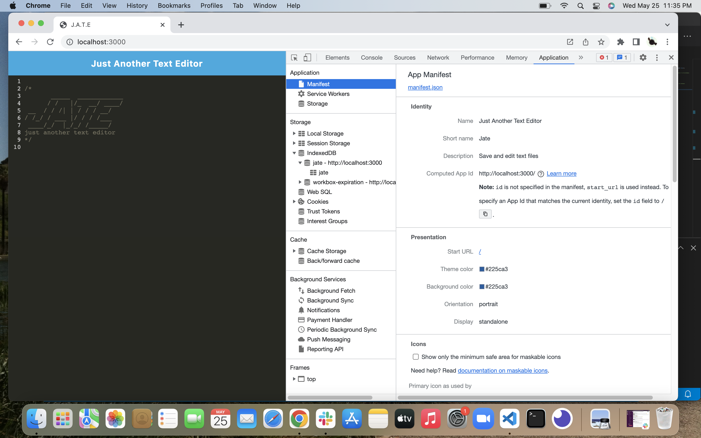
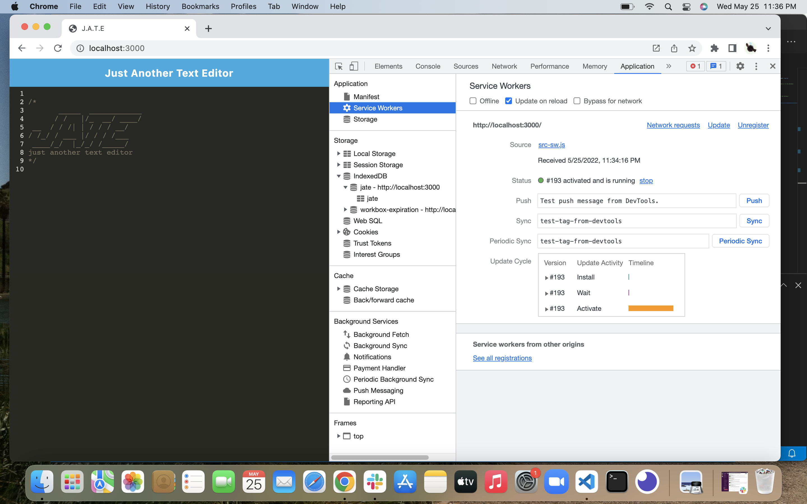
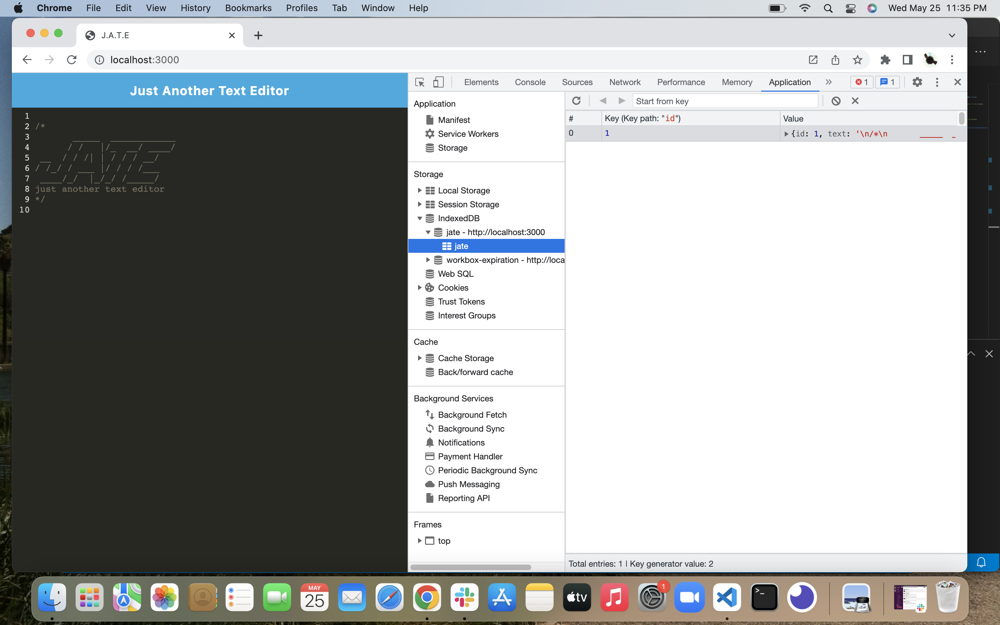

# Progressive-Web-Application-Text-Editor

## Objective

The purpose of this assignment is to develop a Progressive Web Application. The particular application is a text editor which can be used whether one is connected to the internet or not by retrieving and storing data in an IndexedDB database. This application also runs on both the client and server side. 

## Criteria

* When I run my commands in the terminal my javascript files are then bundled using a webpack plug-in and an Html, a service worker, and a manifest page are all generated. 

* I am able to access my application in the browser through localhost. 

* Content is saved in the IndexedDb when exiting out of the application and is retreived when reopening it, through GET and PUT methods. 

* Application can be installed on the user's computer. 

## Mock Up

This video showcases the functionality of the application

This image shows the manifest.json. 

This image shows the service worker.

This images shows the IndexedDB.

[Link to deployed application](https://nick-text-editor.herokuapp.com/)